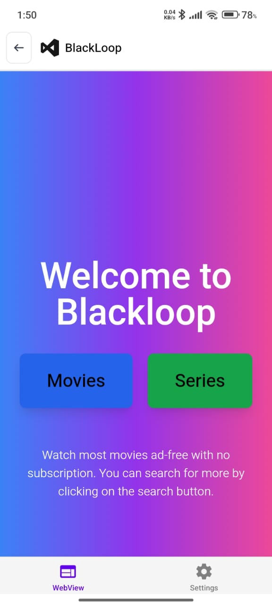
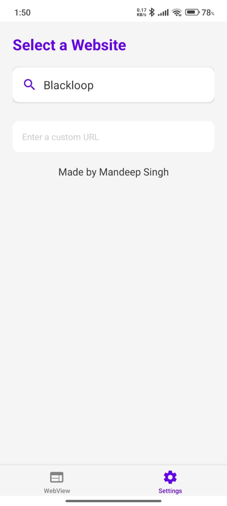

# WebView App with React Native

This is a React Native application that provides a WebView with fullscreen support and allows users to manage custom URLs.

## Features

- **WebView Integration**: Load and browse websites within the app.
- **Fullscreen Support**: Automatically detects and adjusts to fullscreen mode.
- **Custom URL Management**: Add, select, and delete custom URLs.
- **React Navigation**: Tab-based navigation for WebView and Settings screens.
- **AsyncStorage**: Persist user-added URLs.
- **Safe Area Support**: Optimized UI using `react-native-safe-area-context`.

## Technologies Used

- React Native
- React Navigation
- React Native WebView
- AsyncStorage
- React Native System Navigation Bar

## Installation

1. Clone this repository:
   ```sh
   git clone https://github.com/your-username/webview-app.git
   cd webview-app
   ```
2. Install dependencies:
   ```sh
   npm install
   ```
3. Start the development server:
   ```sh
   npx expo start
   ```

## Usage

1. Open the app.
2. Select a predefined website or enter a custom URL.
3. The website will load in the WebView.
4. Enter fullscreen mode when playing videos (automatically detected).
5. Manage custom URLs from the Settings tab.

## Screenshots

### WebView Screen


### Settings Screen


## Contributing

1. Fork the repository.
2. Create a feature branch (`git checkout -b feature-branch`).
3. Commit your changes (`git commit -m "Add new feature"`).
4. Push to the branch (`git push origin feature-branch`).
5. Open a pull request.


## Author

Made by **Mandeep Singh**.

